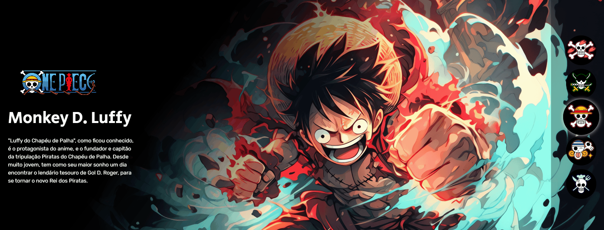

# 🌊 One Piece - Galeria Interativa de Personagens

Este é um projeto visual interativo inspirado no anime **One Piece**, onde o usuário pode visualizar diferentes personagens da tripulação clicando nos ícones laterais. Ao selecionar um personagem, seu nome, imagem e descrição são exibidos com destaque.

---

## 📸 Preview

[](https://alicetolosa.github.io/Projeto-One-Piece/)

---

## 🛠️ Tecnologias utilizadas

- HTML5
- CSS3
- JavaScript
- Imagens ilustrativas da tripulação
- Estrutura organizada com classes e componentes reutilizáveis
---

## ✨ Funcionalidades

- ✅ Exibição de 5 personagens com descrição e imagem
- ✅ Destaque visual para o personagem selecionado
- ✅ Botões com foco animado
- ✅ Layout responsivo para celular e tablet
- ✅ Interação com JavaScript puro (sem bibliotecas externas)

---

## 💡 Lógica JavaScript aplicada

- Quando um botão da tripulação é clicado:
  - O botão anterior perde a classe `selecionado`
  - O botão atual recebe a classe `selecionado`
  - O personagem anterior é ocultado
  - O personagem correspondente ao botão é exibido

```js
botao.addEventListener("click", () => {
    desseleionarBotao();
    deselecionarPersonagem();

    botao.classList.add("selecionado");
    personagens[indice].classList.add("selecionado");
});
